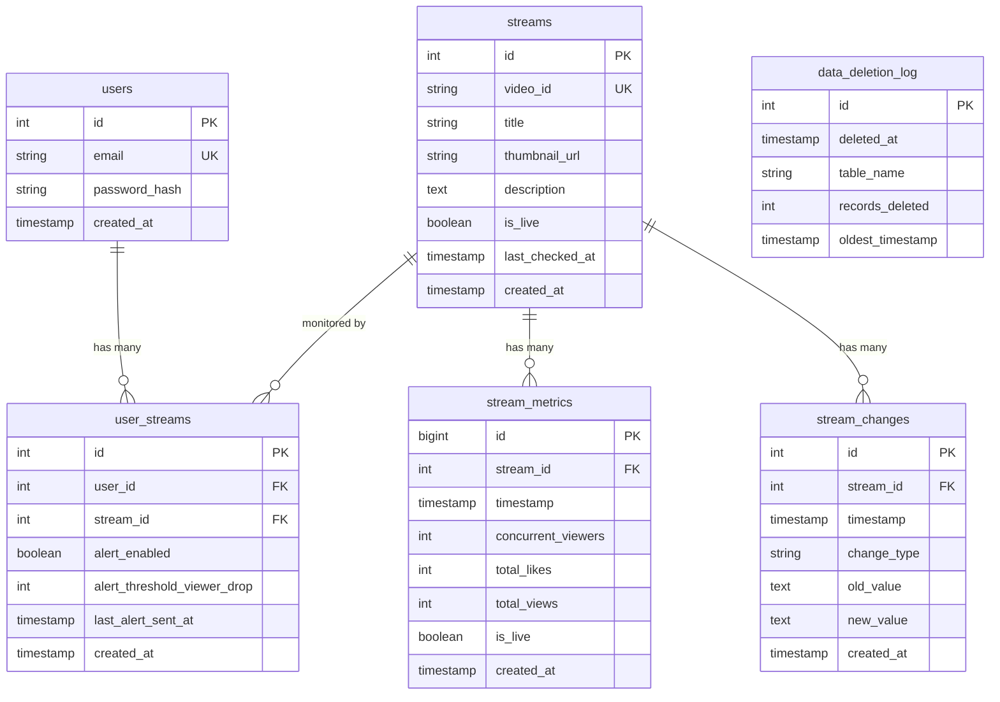

# YouTube Live Stream Monitor - MVP Implementation Plan

**Version:** 1.0
**Date:** 2025-12-30
**Status:** Ready for Review
**Owner:** Development Team
**PRD Reference:** [PRD.md](../PRD.md)

---

## Executive Summary

This plan outlines the complete implementation strategy for building the YouTube Live Stream Monitor MVP, a SaaS platform that tracks 24/7 YouTube live streams, monitors real-time metrics, and sends automated alerts. The platform addresses critical gaps identified in user flow analysis and incorporates 2025 best practices for Next.js 16, PostgreSQL time-series data, and Vercel deployment.

**Key Deliverables:**
- Secure authentication system with Better Auth
- Real-time stream monitoring (60-second polling)
- Interactive time-series visualizations (30-day retention)
- Email alerting for outages and viewer drops
- Compliance with YouTube API 30-day data retention policy

**Timeline:** 9 weeks to MVP (4 phases)
**Tech Stack:** Next.js 16, React 19, PostgreSQL, Better Auth, Vercel

---

## Problem Statement

### The Problem

Content creators and organizations running 24/7 YouTube live streams currently lack effective monitoring solutions:

1. **No Real-Time Metrics Visualization**: No way to see historical trends for concurrent viewers, likes, and views over time
2. **No Change Tracking**: Title, thumbnail, and description updates are not logged or tracked
3. **Manual Monitoring Required**: Content creators must manually check streams for status and performance
4. **No Automated Alerts**: No notifications when streams go offline or experience significant viewer drops
5. **Data Retention Compliance**: Existing tools don't respect YouTube's 30-day data retention policy
6. **API Inefficiency**: No solutions efficiently handle multiple users monitoring the same streams

### Impact

- Users must manually check streams for status and performance trends
- No historical context for troubleshooting performance issues or optimizing content
- Extended downtime periods go unnoticed, resulting in viewer and revenue loss
- Risk of YouTube API Terms of Service violations with non-compliant data retention
- Wasted API quota from duplicate monitoring requests

### Success Criteria

- ✅ Metrics collected every 60 seconds with <5 second variance
- ✅ Charts render in <2 seconds with 30 days of data
- ✅ 100% compliance with 30-day data retention policy (zero violations)
- ✅ API quota savings >50% through deduplication for shared streams
- ✅ Alerts delivered within 2 minutes of detection

---

## Proposed Solution

### High-Level Approach

Build a Next.js 16 SaaS platform with React 19 Server Components that:

1. **Authenticates users** using Better Auth with PostgreSQL adapter
2. **Polls YouTube Data API** every 60 seconds via Vercel Cron
3. **Stores time-series data** in Vercel Postgres with daily partitioning
4. **Deduplicates streams** across multiple users to optimize API quota
5. **Visualizes metrics** on interactive Recharts with real-time updates
6. **Sends email alerts** via Resend for offline streams and viewer drops
7. **Auto-prunes data** older than 30 days for YouTube compliance

### Architecture Diagram

```
┌─────────────────────────────────────────────────────────────┐
│                     Vercel Edge Network                      │
├─────────────────────────────────────────────────────────────┤
│                                                              │
│  Next.js 16 App (React 19 Server Components)                │
│  ┌────────────────┐  ┌──────────────┐  ┌─────────────┐     │
│  │ Dashboard      │  │ API Routes   │  │ Cron Jobs   │     │
│  │ (Streaming RSC)│  │ (Route       │  │ (Every      │     │
│  │                │  │  Handlers)   │  │  60s)       │     │
│  └────────────────┘  └──────────────┘  └─────────────┘     │
│         │                   │                  │            │
└─────────┼───────────────────┼──────────────────┼────────────┘
          │                   │                  │
          ▼                   ▼                  ▼
┌─────────────────────────────────────────────────────────────┐
│              Better Auth (PostgreSQL Adapter)                │
│  • Email/Password Authentication                             │
│  • Session Management (7-day expiry)                         │
│  • Rate Limiting (10 req/min)                                │
│  • CSRF Protection                                           │
│  • Optional: Google OAuth                                    │
└─────────────────────────────────────────────────────────────┘
          │                   │                  │
          ▼                   ▼                  ▼
┌─────────────────────────────────────────────────────────────┐
│         Vercel Postgres (Connection Pooling)                 │
│  ┌────────────────────────────────────────────────────┐     │
│  │ stream_metrics (Partitioned by Day)                │     │
│  │  • Daily partitions (30 partitions total)          │     │
│  │  • Composite indexes (stream_id, timestamp DESC)   │     │
│  │  • Binary COPY for bulk inserts                    │     │
│  │  • Auto-cleanup with pg_partman                    │     │
│  └────────────────────────────────────────────────────┘     │
│  │ users, streams, user_streams, stream_changes,      │     │
│  │ data_deletion_log                                  │     │
└─────────────────────────────────────────────────────────────┘
                              │
                              ▼
                    ┌──────────────────┐
                    │  YouTube API v3  │
                    │  • Batch requests│
                    │    (50 IDs max)  │
                    │  • ETag caching  │
                    │  • Quota mgmt    │
                    │  • 10K units/day │
                    └──────────────────┘
                              │
                              ▼
                    ┌──────────────────┐
                    │ Resend + React   │
                    │ Email Alerts     │
                    │ • Rate limited   │
                    │ • CAN-SPAM       │
                    │ • Templates      │
                    └──────────────────┘
```

---

## Technical Approach

### 1. Authentication System (Better Auth)

**Library:** [Better Auth](https://www.better-auth.com/docs/introduction)

**Configuration:**
```typescript
// lib/auth.ts
import { betterAuth } from "better-auth"
import { Pool } from "pg"

export const auth = betterAuth({
  appName: "YouTube Live Stream Monitor",
  baseURL: process.env.BETTER_AUTH_URL,
  secret: process.env.BETTER_AUTH_SECRET,

  database: new Pool({
    connectionString: process.env.POSTGRES_URL,
    max: 1, // Serverless optimization
    idleTimeoutMillis: 5000
  }),

  emailAndPassword: {
    enabled: true,
    minPasswordLength: 8,
    async sendResetPassword({ user, url }) {
      await sendEmail({
        to: user.email,
        subject: "Reset your password",
        template: "password-reset",
        data: { url }
      })
    }
  },

  session: {
    expiresIn: 60 * 60 * 24 * 7, // 7 days
    updateAge: 60 * 60 * 24, // Update after 1 day
    freshAge: 60 * 10 // Fresh for 10 minutes
  },

  rateLimit: {
    enabled: true,
    window: 60,
    max: 10,
    storage: "database" // Multi-instance support
  }
})
```

**Key Features:**
- Email/password authentication with bcrypt (cost factor 12+)
- Secure session management (httpOnly, sameSite cookies)
- CSRF protection enabled by default
- Rate limiting with database storage
- Optional Google OAuth for future enhancement

**Security Decisions:**
- ✅ Email verification: **Optional for MVP** (can be enabled later)
- ✅ Password requirements: Minimum 8 characters, no special requirements
- ✅ Session timeout: 7 days with refresh
- ✅ Account lockout: Handled by Better Auth rate limiting (10 attempts/min)
- ✅ Email changes: Require verification of new email address

---

### 2. Database Schema (PostgreSQL with Drizzle ORM)

**ORM Choice:** Drizzle ORM
- 14x lower latency than Prisma in serverless environments
- Type-safe queries with excellent inference
- Better performance for time-series data

**Schema Definition:**
```typescript
// db/schema.ts
import { pgTable, serial, varchar, text, timestamp, boolean, integer, uniqueIndex, index } from 'drizzle-orm/pg-core'

// Better Auth will create: users, sessions, verificationTokens

export const streams = pgTable('streams', {
  id: serial('id').primaryKey(),
  videoId: varchar('video_id', { length: 50 }).notNull().unique(),
  title: text('title').notNull(),
  thumbnailUrl: text('thumbnail_url'),
  description: text('description'),
  isLive: boolean('is_live').default(false),
  lastCheckedAt: timestamp('last_checked_at'),
  createdAt: timestamp('created_at').defaultNow(),
  updatedAt: timestamp('updated_at').defaultNow()
}, (table) => ({
  videoIdIdx: uniqueIndex('idx_streams_video_id').on(table.videoId),
  lastCheckedIdx: index('idx_streams_last_checked').on(table.lastCheckedAt)
}))

export const userStreams = pgTable('user_streams', {
  id: serial('id').primaryKey(),
  userId: integer('user_id').notNull().references(() => users.id, { onDelete: 'cascade' }),
  streamId: integer('stream_id').notNull().references(() => streams.id, { onDelete: 'cascade' }),
  alertEnabled: boolean('alert_enabled').default(true),
  alertThresholdViewerDrop: integer('alert_threshold_viewer_drop').default(20),
  lastAlertSentAt: timestamp('last_alert_sent_at'),
  createdAt: timestamp('created_at').defaultNow()
}, (table) => ({
  userStreamUnique: uniqueIndex('idx_user_stream_unique').on(table.userId, table.streamId),
  userIdx: index('idx_user_streams_user').on(table.userId),
  streamIdx: index('idx_user_streams_stream').on(table.streamId)
}))

// Partitioned table (see below)
export const streamMetrics = pgTable('stream_metrics', {
  id: serial('id').primaryKey(),
  streamId: integer('stream_id').notNull().references(() => streams.id, { onDelete: 'cascade' }),
  timestamp: timestamp('timestamp').notNull().defaultNow(),
  concurrentViewers: integer('concurrent_viewers').default(0),
  totalLikes: integer('total_likes').default(0),
  totalViews: integer('total_views').default(0),
  isLive: boolean('is_live').default(false),
  createdAt: timestamp('created_at').defaultNow()
}, (table) => ({
  streamTimeIdx: index('idx_metrics_stream_timestamp').on(table.streamId, table.timestamp.desc()),
  timestampIdx: index('idx_metrics_timestamp').on(table.timestamp)
}))

export const streamChanges = pgTable('stream_changes', {
  id: serial('id').primaryKey(),
  streamId: integer('stream_id').notNull().references(() => streams.id, { onDelete: 'cascade' }),
  timestamp: timestamp('timestamp').notNull().defaultNow(),
  changeType: varchar('change_type', { length: 20 }).notNull(), // 'title', 'thumbnail', 'description'
  oldValue: text('old_value'),
  newValue: text('new_value'),
  createdAt: timestamp('created_at').defaultNow()
}, (table) => ({
  streamTimeIdx: index('idx_changes_stream_timestamp').on(table.streamId, table.timestamp.desc()),
  timestampIdx: index('idx_changes_timestamp').on(table.timestamp)
}))

export const dataDeletionLog = pgTable('data_deletion_log', {
  id: serial('id').primaryKey(),
  deletedAt: timestamp('deleted_at').defaultNow(),
  tableName: varchar('table_name', { length: 50 }).notNull(),
  recordsDeleted: integer('records_deleted').notNull(),
  oldestTimestamp: timestamp('oldest_timestamp'),
  newestTimestamp: timestamp('newest_timestamp')
})
```

**Partitioning Strategy:**
```sql
-- After Drizzle creates the base table, manually partition it
-- lib/db/migrations/partition-stream-metrics.sql

-- Convert to partitioned table
ALTER TABLE stream_metrics RENAME TO stream_metrics_old;

CREATE TABLE stream_metrics (
    id BIGSERIAL,
    stream_id INTEGER NOT NULL,
    timestamp TIMESTAMP NOT NULL DEFAULT NOW(),
    concurrent_viewers INTEGER DEFAULT 0,
    total_likes INTEGER DEFAULT 0,
    total_views INTEGER DEFAULT 0,
    is_live BOOLEAN DEFAULT false,
    created_at TIMESTAMP DEFAULT NOW(),
    PRIMARY KEY (id, timestamp)
) PARTITION BY RANGE (timestamp);

-- Create initial 30 daily partitions
-- Example: 2025-12-30
CREATE TABLE stream_metrics_2025_12_30
    PARTITION OF stream_metrics
    FOR VALUES FROM ('2025-12-30 00:00:00+00') TO ('2025-12-31 00:00:00+00');

-- Install pg_partman for auto-management
CREATE EXTENSION IF NOT EXISTS pg_partman;

SELECT partman.create_parent(
    'public.stream_metrics',
    'timestamp',
    'native',
    'daily',
    p_start_partition := '2025-12-01'
);

-- Set 30-day retention
UPDATE partman.part_config
SET retention = '30 days',
    retention_keep_table = false
WHERE parent_table = 'public.stream_metrics';

-- Create indexes on each partition
CREATE INDEX CONCURRENTLY idx_metrics_20251230_stream_time
    ON stream_metrics_2025_12_30 (stream_id, timestamp DESC);
```

**Migration Strategy:**
- Use Drizzle Kit for schema migrations
- Manual SQL for partitioning setup
- Weekly backup strategy with point-in-time recovery

---

### 3. YouTube API Integration

**Library:** `@googleapis/youtube`

**Quota Management:**
- Free tier: 10,000 units/day
- `videos.list` batch (50 IDs): 1 unit
- Max streams at 60s polling: ~347 streams
- Target for MVP: 100 streams (uses ~1,440 units/day)

**Implementation:**
```typescript
// lib/youtube-client.ts
import { google } from 'googleapis'

const youtube = google.youtube({
  version: 'v3',
  auth: process.env.YOUTUBE_API_KEY
})

const etagCache = new Map<string, string>()

export async function fetchStreamData(videoIds: string[]) {
  const batches = chunk(videoIds, 50) // Max 50 per request

  const results = await Promise.all(
    batches.map(batch =>
      youtube.videos.list({
        part: ['snippet', 'liveStreamingDetails', 'statistics'],
        id: batch.join(','),
        headers: {
          'If-None-Match': etagCache.get(batch[0]) // ETag optimization
        }
      }).catch(handleYouTubeError)
    )
  )

  return results.flatMap(r => r.data.items || [])
}

function handleYouTubeError(error: any) {
  if (error.code === 403) {
    // Quota exceeded
    console.error('YouTube API quota exceeded')
    // Send admin alert
    return { data: { items: [] } }
  }

  if (error.code >= 500) {
    // YouTube server error - retry with exponential backoff
    return retryWithBackoff(() => youtube.videos.list(...))
  }

  throw error
}
```

**Error Handling Decisions:**
- ✅ Quota exceeded: Log error, skip poll, alert admin, resume next day
- ✅ YouTube 500 error: Retry 3 times with exponential backoff (1s, 2s, 4s)
- ✅ Timeout: Retry once, skip if still fails
- ✅ Invalid video ID: Mark stream as inactive, notify user via dashboard
- ✅ Rate limiting: Implement with exponential backoff

---

### 4. Data Collection Cron Job

**Configuration:**
```typescript
// vercel.json
{
  "crons": [
    {
      "path": "/api/cron/poll-youtube",
      "schedule": "* * * * *" // Every minute
    },
    {
      "path": "/api/cron/prune-data",
      "schedule": "0 2 * * *" // Daily at 2 AM UTC
    }
  ]
}
```

**Polling Service:**
```typescript
// app/api/cron/poll-youtube/route.ts
export async function GET(req: Request) {
  // Verify cron secret
  const authHeader = req.headers.get('authorization')
  if (authHeader !== `Bearer ${process.env.CRON_SECRET}`) {
    return new Response('Unauthorized', { status: 401 })
  }

  // Acquire distributed lock (prevent concurrent executions)
  const lock = await acquireLock('youtube-poll')
  if (!lock) {
    return Response.json({ skipped: 'already running' })
  }

  try {
    // Fetch streams that need polling (last polled >55s ago)
    const streams = await db.query.streams.findMany({
      where: or(
        eq(streams.isLive, true),
        lt(streams.lastCheckedAt, new Date(Date.now() - 55000))
      ),
      limit: 200 // Max 200 streams per execution (prevent timeout)
    })

    if (streams.length === 0) {
      return Response.json({ message: 'No streams to poll' })
    }

    // Fetch data from YouTube
    const videoIds = streams.map(s => s.videoId)
    const youtubeData = await fetchStreamData(videoIds)

    // Process each stream
    const metricsToInsert = []
    const changesToInsert = []

    for (const video of youtubeData) {
      const stream = streams.find(s => s.videoId === video.id)
      if (!stream) continue

      // Extract metrics
      const metrics = {
        streamId: stream.id,
        timestamp: new Date(),
        concurrentViewers: parseInt(video.liveStreamingDetails?.concurrentViewers || '0'),
        totalLikes: parseInt(video.statistics?.likeCount || '0'),
        totalViews: parseInt(video.statistics?.viewCount || '0'),
        isLive: !!video.liveStreamingDetails?.actualStartTime
      }

      metricsToInsert.push(metrics)

      // Detect metadata changes
      if (stream.title !== video.snippet?.title) {
        changesToInsert.push({
          streamId: stream.id,
          timestamp: new Date(),
          changeType: 'title',
          oldValue: stream.title,
          newValue: video.snippet?.title
        })
      }

      // Similar for thumbnail and description...

      // Check alert conditions
      await checkAlertConditions(stream, metrics)
    }

    // Batch insert metrics (use INSERT...UNNEST for performance)
    if (metricsToInsert.length > 0) {
      await db.insert(streamMetrics).values(metricsToInsert)
    }

    if (changesToInsert.length > 0) {
      await db.insert(streamChanges).values(changesToInsert)
    }

    return Response.json({
      success: true,
      polled: streams.length,
      metricsInserted: metricsToInsert.length
    })

  } finally {
    await releaseLock(lock)
  }
}
```

**Timeout Handling:**
- Vercel function timeout: 10 seconds (Hobby) / 60 seconds (Pro)
- Max 200 streams per execution to stay under 10s limit
- If >200 active streams: Run cron more frequently or stagger polls

**Decisions:**
- ✅ Max streams per cron: 200 (prevents timeout)
- ✅ Polling frequency: Every 60 seconds
- ✅ Retry strategy: 3 retries with exponential backoff
- ✅ Partial batch failure: Log error, continue with successful items
- ✅ Concurrent execution: Prevent with distributed lock (Redis or DB-based)

---

### 5. Alerting System

**Email Service:** Resend + React Email

**Alert Logic:**
```typescript
// lib/alerts.ts
async function checkAlertConditions(stream: Stream, metrics: StreamMetric) {
  const users = await db.query.userStreams.findMany({
    where: and(
      eq(userStreams.streamId, stream.id),
      eq(userStreams.alertEnabled, true)
    ),
    with: { user: true }
  })

  for (const userStream of users) {
    // Check offline alert
    if (stream.isLive && !metrics.isLive) {
      await sendOfflineAlert(userStream.user, stream)
    }

    // Check viewer drop alert
    const previousMetric = await getPreviousMetric(stream.id)
    if (previousMetric) {
      const dropPercent = ((previousMetric.concurrentViewers - metrics.concurrentViewers) / previousMetric.concurrentViewers) * 100

      if (dropPercent >= userStream.alertThresholdViewerDrop) {
        // Check rate limit (no duplicate alerts within 10 minutes)
        if (canSendAlert(userStream)) {
          await sendViewerDropAlert(userStream.user, stream, dropPercent)
          await db.update(userStreams)
            .set({ lastAlertSentAt: new Date() })
            .where(eq(userStreams.id, userStream.id))
        }
      }
    }
  }
}

function canSendAlert(userStream: UserStream): boolean {
  if (!userStream.lastAlertSentAt) return true

  const tenMinutesAgo = new Date(Date.now() - 10 * 60 * 1000)
  return userStream.lastAlertSentAt < tenMinutesAgo
}
```

**Email Templates:**
```typescript
// emails/stream-offline.tsx
import { Html, Head, Body, Container, Text, Button, Link } from '@react-email/components'

export function StreamOfflineEmail({ streamTitle, streamUrl, userName }: Props) {
  return (
    <Html>
      <Head />
      <Body style={{ fontFamily: 'sans-serif' }}>
        <Container>
          <Text>Hi {userName},</Text>
          <Text>
            Your monitored stream "{streamTitle}" has gone offline.
          </Text>
          <Button href={`https://yourdomain.com/dashboard/streams/${streamUrl}`}>
            View Dashboard
          </Button>

          {/* CAN-SPAM Compliance */}
          <Text style={{ fontSize: 12, color: '#666', marginTop: 40 }}>
            You're receiving this because you enabled offline alerts for this stream.
            <Link href="/settings/alerts">Manage alert preferences</Link>
          </Text>
          <Text style={{ fontSize: 12, color: '#666' }}>
            YouTube Live Stream Monitor<br />
            123 Main St, San Francisco, CA 94105
          </Text>
        </Container>
      </Body>
    </Html>
  )
}
```

**Decisions:**
- ✅ Email delivery failure: Retry once after 5 minutes, log as failed if still fails
- ✅ Bounced emails: Log bounce, continue sending (user can unsubscribe)
- ✅ Alert aggregation: No aggregation for MVP (individual alerts)
- ✅ Alert frequency: Rate limit 1 alert per stream per user every 10 minutes
- ✅ Email template: HTML + plain text fallback
- ✅ CAN-SPAM compliance: Include physical address, unsubscribe link

---

### 6. Visualization (Recharts)

**Chart Library:** Recharts (chosen over Tremor for flexibility)

**Component Structure:**
```typescript
// components/stream-chart.tsx
'use client'

import { LineChart, Line, XAxis, YAxis, Tooltip, ResponsiveContainer } from 'recharts'
import { useQuery } from '@tanstack/react-query'

export function StreamChart({ streamId, timeRange }: Props) {
  const { data, isLoading } = useQuery({
    queryKey: ['stream-metrics', streamId, timeRange],
    queryFn: () => fetchMetrics(streamId, timeRange),
    refetchInterval: timeRange === 'today' ? 60000 : false // Auto-refresh for Today
  })

  if (isLoading) {
    return <ChartSkeleton />
  }

  if (!data || data.length === 0) {
    return (
      <EmptyState>
        <p>No data available yet. We'll start collecting data within 60 seconds.</p>
      </EmptyState>
    )
  }

  // Downsample for 30-day view (43,200 points → 2,000 points)
  const chartData = timeRange === '30d' ? downsample(data, 2000) : data

  return (
    <ResponsiveContainer width="100%" height={400}>
      <LineChart data={chartData}>
        <XAxis
          dataKey="timestamp"
          tickFormatter={formatTimestamp}
          minTickGap={50}
        />
        <YAxis
          tickFormatter={formatNumber}
          domain={['auto', 'auto']}
        />
        <Tooltip
          content={<CustomTooltip />}
          labelFormatter={formatTooltipLabel}
        />
        <Line
          type="monotone"
          dataKey="concurrentViewers"
          stroke="#8884d8"
          strokeWidth={2}
          dot={false} // Disable dots for performance
        />
      </LineChart>
    </ResponsiveContainer>
  )
}
```

**Performance Optimization:**
```typescript
// lib/downsample.ts
// Largest Triangle Three Buckets (LTTB) algorithm
export function downsample(data: Point[], targetSize: number): Point[] {
  if (data.length <= targetSize) return data

  const sampledData = []
  const bucketSize = (data.length - 2) / (targetSize - 2)

  sampledData.push(data[0]) // Always include first point

  for (let i = 0; i < targetSize - 2; i++) {
    const bucketStart = Math.floor((i + 1) * bucketSize) + 1
    const bucketEnd = Math.floor((i + 2) * bucketSize) + 1

    // Select point with largest triangle area
    const selectedPoint = selectPointByLargestTriangle(
      data.slice(bucketStart, bucketEnd),
      sampledData[sampledData.length - 1],
      data[bucketEnd]
    )

    sampledData.push(selectedPoint)
  }

  sampledData.push(data[data.length - 1]) // Always include last point

  return sampledData
}
```

**Decisions:**
- ✅ Missing data points: Show as gaps (null values), don't interpolate
- ✅ 30-day performance: Downsample to 2,000 points using LTTB algorithm
- ✅ Chart interactions: Hover tooltips only for MVP, no zoom/pan
- ✅ Metadata markers: Stack markers, show count on hover for dense timelines
- ✅ Accessibility: Add ARIA labels, keyboard navigation, screen reader support (WCAG 2.1 AA)
- ✅ Chart export: Not included in MVP (future enhancement)

---

## Implementation Phases

### Phase 0: Project Setup & Infrastructure (Week 1)

**Duration:** 5-7 days
**Team:** 1-2 developers

**Tasks:**
- [x] Review PRD and todos.md
- [ ] Set up development environment
  - [ ] Copy `.env.example` to `.env.local`
  - [ ] Generate secrets: `openssl rand -base64 32`
  - [ ] Install dependencies: `npm install`
- [ ] Vercel account setup
  - [ ] Connect GitHub repository
  - [ ] Add Vercel Postgres storage
  - [ ] Configure environment variables
  - [ ] Pull environment variables: `vercel env pull .env.local`
- [ ] YouTube Data API setup
  - [ ] Create Google Cloud project
  - [ ] Enable YouTube Data API v3
  - [ ] Create and restrict API key
  - [ ] Test API key with sample video
- [ ] Resend email setup
  - [ ] Sign up and verify domain
  - [ ] Generate API key
  - [ ] Test email sending

**Deliverables:**
- ✅ All environment variables configured
- ✅ Vercel Postgres database connected
- ✅ YouTube API key validated
- ✅ Resend email delivery confirmed

**Files Modified:**
- `.env.local` (created)
- `vercel.json` (created)

---

### Phase 1: Core Monitoring & Authentication (Weeks 2-4)

**Duration:** 15-21 days
**Team:** 2-3 developers

#### Milestone 1.1: Authentication System (Week 2)

**Tasks:**
- [ ] Install Better Auth and dependencies
- [ ] Configure Better Auth with PostgreSQL adapter
  - [ ] File: `lib/auth.ts`
  - [ ] Database configuration with connection pooling
  - [ ] Email/password authentication
  - [ ] Session management (7-day expiry)
  - [ ] Rate limiting (10 req/min)
- [ ] Create authentication UI pages
  - [ ] File: `app/auth/register/page.tsx`
  - [ ] File: `app/auth/login/page.tsx`
  - [ ] File: `app/auth/reset-password/page.tsx`
  - [ ] Form validation with Zod
  - [ ] shadcn/ui components (Input, Button, Card)
- [ ] Implement protected routes
  - [ ] File: `middleware.ts`
  - [ ] Redirect unauthenticated users to login
  - [ ] Session validation
- [ ] Add logout functionality
- [ ] Create user profile page
  - [ ] File: `app/profile/page.tsx`
  - [ ] Update email/password
  - [ ] Account deletion

**Deliverables:**
- ✅ User registration and login working
- ✅ Sessions persist across page refreshes
- ✅ Protected routes redirect to login
- ✅ Password reset flow functional

**Testing:**
- Register new user
- Login with valid/invalid credentials
- Reset password
- Access protected route while logged out
- Delete account

---

#### Milestone 1.2: Database Schema & Migrations (Week 2)

**Tasks:**
- [ ] Install Drizzle ORM and PostgreSQL driver
  - [ ] `npm install drizzle-orm @vercel/postgres`
  - [ ] `npm install -D drizzle-kit`
- [ ] Define database schema
  - [ ] File: `db/schema.ts`
  - [ ] Tables: streams, user_streams, stream_metrics, stream_changes, data_deletion_log
  - [ ] Indexes for performance
  - [ ] Foreign key constraints
- [ ] Generate and run migrations
  - [ ] `drizzle-kit generate:pg`
  - [ ] `drizzle-kit push:pg`
- [ ] Set up table partitioning
  - [ ] File: `db/migrations/partition-stream-metrics.sql`
  - [ ] Create daily partitions for 30 days
  - [ ] Install pg_partman extension
  - [ ] Configure auto-partition management
- [ ] Test schema with sample data

**Deliverables:**
- ✅ All tables created in Vercel Postgres
- ✅ Indexes applied
- ✅ Partitioning configured
- ✅ Sample data inserts successful

**Files Created:**
- `db/schema.ts`
- `db/migrations/*.sql`
- `drizzle.config.ts`

---

#### Milestone 1.3: YouTube API Client (Week 3)

**Tasks:**
- [ ] Install YouTube API client
  - [ ] `npm install @googleapis/youtube`
- [ ] Create YouTube API wrapper
  - [ ] File: `lib/youtube-client.ts`
  - [ ] Batch request function (50 IDs max)
  - [ ] ETag caching for optimization
  - [ ] Error handling (quota, rate limit, timeout)
  - [ ] Retry logic with exponential backoff
- [ ] Add quota tracking
  - [ ] Log API calls to database
  - [ ] Create admin quota dashboard
- [ ] Test with sample video IDs

**Deliverables:**
- ✅ YouTube API client fetches live stream data
- ✅ Batch requests working (50 IDs)
- ✅ Error handling implemented
- ✅ Quota tracking functional

**Files Created:**
- `lib/youtube-client.ts`
- `lib/quota-tracker.ts`

---

#### Milestone 1.4: Data Collection Cron (Week 3)

**Tasks:**
- [ ] Create polling service
  - [ ] File: `lib/youtube-poller.ts`
  - [ ] Function: `pollYouTubeMetrics()`
  - [ ] Fetch active streams from database
  - [ ] Batch video IDs (50 per request)
  - [ ] Extract metrics: viewers, likes, views, is_live
  - [ ] Insert metrics using batch insert (INSERT...UNNEST)
  - [ ] Update `streams.last_checked_at`
- [ ] Implement metadata change detection
  - [ ] Function: `checkMetadataChanges()`
  - [ ] Compare title, thumbnail, description
  - [ ] Insert change records
  - [ ] Update stream metadata
- [ ] Create Vercel Cron endpoint
  - [ ] File: `app/api/cron/poll-youtube/route.ts`
  - [ ] Verify CRON_SECRET
  - [ ] Call polling service
  - [ ] Return success/error response
  - [ ] Log errors
- [ ] Add distributed lock (prevent concurrent runs)
- [ ] Configure Vercel Cron
  - [ ] Update `vercel.json`
  - [ ] Schedule: `* * * * *` (every minute)

**Deliverables:**
- ✅ Cron job runs every 60 seconds
- ✅ Metrics inserted into database
- ✅ Metadata changes detected and logged
- ✅ Error handling functional

**Files Created:**
- `lib/youtube-poller.ts`
- `app/api/cron/poll-youtube/route.ts`
- `vercel.json` (updated)

---

#### Milestone 1.5: Stream Management UI (Week 4)

**Tasks:**
- [ ] Create dashboard page
  - [ ] File: `app/dashboard/page.tsx`
  - [ ] Server Component with Suspense
  - [ ] Fetch user's streams
  - [ ] Display stream cards
- [ ] Build "Add Stream" modal
  - [ ] File: `components/add-stream-modal.tsx`
  - [ ] Input for YouTube video ID/URL
  - [ ] Validation (YouTube ID format)
  - [ ] Submit to API
  - [ ] Handle errors (invalid ID, duplicate, offline stream)
- [ ] Create API route for adding streams
  - [ ] File: `app/api/streams/add/route.ts`
  - [ ] Validate video ID
  - [ ] Check YouTube API (is it a live stream?)
  - [ ] Check for duplicates (deduplication logic)
  - [ ] Create stream record or link to existing
  - [ ] Return success/error
- [ ] Build stream card component
  - [ ] File: `components/stream-card.tsx`
  - [ ] Display: thumbnail, title, status (online/offline)
  - [ ] "Remove" button
  - [ ] "View Details" link
- [ ] Implement remove stream functionality
  - [ ] Confirmation dialog
  - [ ] API route: `app/api/streams/[id]/remove/route.ts`
  - [ ] Delete user_streams relationship
  - [ ] If last user: delete stream + all data
- [ ] Add loading and empty states
  - [ ] Skeleton for stream list
  - [ ] Empty state: "No streams monitored yet"

**Deliverables:**
- ✅ Users can add YouTube streams by ID or URL
- ✅ Stream deduplication working
- ✅ Stream list displays with status
- ✅ Users can remove streams

**Files Created:**
- `app/dashboard/page.tsx`
- `components/add-stream-modal.tsx`
- `components/stream-card.tsx`
- `app/api/streams/add/route.ts`
- `app/api/streams/[id]/remove/route.ts`

---

### Phase 2: Visualization & Change Tracking (Weeks 5-6)

**Duration:** 10-14 days
**Team:** 2 developers

#### Milestone 2.1: Time-Series Data API (Week 5)

**Tasks:**
- [ ] Create metrics API endpoint
  - [ ] File: `app/api/streams/[id]/metrics/route.ts`
  - [ ] Accept query params: `timeRange` (today, 7d, 14d, 30d)
  - [ ] Query `stream_metrics` with date range filter
  - [ ] Return JSON: `[{ timestamp, viewers, likes, views }]`
  - [ ] Optimize query (<500ms for 30 days)
  - [ ] Add caching headers (60-second cache)
- [ ] Create changes API endpoint
  - [ ] File: `app/api/streams/[id]/changes/route.ts`
  - [ ] Query `stream_changes` with date range
  - [ ] Return JSON: `[{ timestamp, changeType, oldValue, newValue }]`
- [ ] Add error handling and authorization
  - [ ] Verify user has access to stream
  - [ ] Return 403 if not authorized

**Deliverables:**
- ✅ API returns metrics data for all time ranges
- ✅ Query performance <500ms
- ✅ Caching headers applied
- ✅ Authorization working

**Files Created:**
- `app/api/streams/[id]/metrics/route.ts`
- `app/api/streams/[id]/changes/route.ts`

---

#### Milestone 2.2: Interactive Charts (Week 5-6)

**Tasks:**
- [ ] Install chart library
  - [ ] `npm install recharts @tanstack/react-query`
- [ ] Create stream detail page
  - [ ] File: `app/dashboard/streams/[id]/page.tsx`
  - [ ] Server Component shell
  - [ ] Client Component for charts
- [ ] Build chart component
  - [ ] File: `components/stream-chart.tsx`
  - [ ] Time range selector (Today, 7d, 14d, 30d)
  - [ ] Line chart for concurrent viewers
  - [ ] Separate lines for likes and views
  - [ ] Responsive container
- [ ] Implement auto-refresh
  - [ ] TanStack Query with 60s refetch interval
  - [ ] Only for "Today" view
  - [ ] Optimistic updates
- [ ] Add loading and empty states
  - [ ] Chart skeleton
  - [ ] Empty state: "No data yet"
- [ ] Implement downsampling
  - [ ] File: `lib/downsample.ts`
  - [ ] LTTB algorithm
  - [ ] Downsample 30-day view to 2,000 points
- [ ] Add metadata change markers
  - [ ] Overlay markers on timeline
  - [ ] Tooltip showing old/new values
  - [ ] Stack markers for dense timelines
- [ ] Implement custom tooltip
  - [ ] Show exact values on hover
  - [ ] Format numbers (1.2M)
  - [ ] Format timestamps
- [ ] Add accessibility features
  - [ ] ARIA labels
  - [ ] Keyboard navigation
  - [ ] Screen reader support

**Deliverables:**
- ✅ Interactive charts render for all time ranges
- ✅ Charts load in <2 seconds with 30 days of data
- ✅ Auto-refresh working for Today view
- ✅ Metadata change markers displayed
- ✅ WCAG 2.1 AA compliance

**Files Created:**
- `app/dashboard/streams/[id]/page.tsx`
- `components/stream-chart.tsx`
- `components/chart-tooltip.tsx`
- `lib/downsample.ts`

---

### Phase 3: Alerting System (Weeks 7-8)

**Duration:** 10-14 days
**Team:** 2 developers

#### Milestone 3.1: Email Integration (Week 7)

**Tasks:**
- [ ] Install Resend and React Email
  - [ ] `npm install resend react-email`
- [ ] Create email service wrapper
  - [ ] File: `lib/email-service.ts`
  - [ ] Function: `sendEmail()`
  - [ ] Error handling and retry logic
- [ ] Build email templates
  - [ ] File: `emails/stream-offline.tsx`
  - [ ] File: `emails/viewer-drop.tsx`
  - [ ] HTML + plain text
  - [ ] Include stream thumbnail, title, timestamp
  - [ ] Add unsubscribe link (CAN-SPAM)
  - [ ] Physical address in footer
- [ ] Test email delivery
  - [ ] Development preview with React Email
  - [ ] Send test emails

**Deliverables:**
- ✅ Email service sending emails via Resend
- ✅ Email templates rendering correctly
- ✅ CAN-SPAM compliance

**Files Created:**
- `lib/email-service.ts`
- `emails/stream-offline.tsx`
- `emails/viewer-drop.tsx`

---

#### Milestone 3.2: Alert Logic (Week 7-8)

**Tasks:**
- [ ] Implement offline detection
  - [ ] File: `lib/alerts.ts`
  - [ ] Function: `checkAlertConditions()`
  - [ ] Compare previous vs current `is_live` status
  - [ ] Detect status change from true → false
  - [ ] Trigger offline alert
- [ ] Implement viewer drop detection
  - [ ] Calculate percentage drop
  - [ ] Check if drop >= user's threshold
  - [ ] Trigger viewer drop alert
- [ ] Add rate limiting
  - [ ] Function: `canSendAlert()`
  - [ ] Check `last_alert_sent_at`
  - [ ] No duplicate alerts within 10 minutes
- [ ] Create alert sending functions
  - [ ] Function: `sendOfflineAlert()`
  - [ ] Function: `sendViewerDropAlert()`
  - [ ] Query users monitoring stream
  - [ ] Check if alerts enabled
  - [ ] Send email to each user
  - [ ] Update `last_alert_sent_at`
- [ ] Integrate alerts into polling cron
  - [ ] Call `checkAlertConditions()` after metrics insert
  - [ ] Log alert delivery success/failure

**Deliverables:**
- ✅ Offline alerts sent within 2 minutes
- ✅ Viewer drop alerts sent based on threshold
- ✅ Rate limiting working (10-minute cooldown)

**Files Modified:**
- `lib/alerts.ts` (created)
- `app/api/cron/poll-youtube/route.ts` (updated)

---

#### Milestone 3.3: Alert Preferences UI (Week 8)

**Tasks:**
- [ ] Create alert settings modal
  - [ ] File: `components/alert-settings-modal.tsx`
  - [ ] Toggle: Enable/disable alerts
  - [ ] Slider: Viewer drop threshold (1-100%)
  - [ ] Form validation
- [ ] Create API route for saving preferences
  - [ ] File: `app/api/user-streams/[id]/settings/route.ts`
  - [ ] Update `user_streams` table
  - [ ] Validate threshold (1-100%)
  - [ ] Return success/error
- [ ] Add settings button to stream card
  - [ ] Open modal on click
  - [ ] Load current settings
  - [ ] Save on submit
- [ ] Add alert indicator badge
  - [ ] Show on stream card if alerts enabled
  - [ ] Visual indicator of alert status
- [ ] Add "Test Alert" button (optional)
  - [ ] Send sample email
  - [ ] Verify delivery

**Deliverables:**
- ✅ Users can configure alert settings per stream
- ✅ Alert preferences saved and loaded
- ✅ Alert indicator visible on stream cards

**Files Created:**
- `components/alert-settings-modal.tsx`
- `app/api/user-streams/[id]/settings/route.ts`

---

### Phase 4: Polish & Launch (Week 9)

**Duration:** 5-7 days
**Team:** 2-3 developers

#### Milestone 4.1: UI/UX Refinements (Days 1-2)

**Tasks:**
- [ ] Review all shadcn/ui components
  - [ ] Consistent spacing and typography
  - [ ] Color palette and contrast ratios
  - [ ] Dark mode support (optional)
- [ ] Add loading skeletons for all async content
  - [ ] Dashboard stream list
  - [ ] Chart data loading
  - [ ] Form submissions
- [ ] Improve error messages
  - [ ] User-friendly copy
  - [ ] Actionable error states
  - [ ] Toast notifications for success/error
- [ ] Add success toast notifications
  - [ ] Stream added
  - [ ] Stream removed
  - [ ] Alert settings saved
- [ ] Implement smooth transitions
  - [ ] Page transitions
  - [ ] Modal animations
  - [ ] Loading state transitions

**Deliverables:**
- ✅ Consistent UI/UX across all pages
- ✅ All loading and error states implemented
- ✅ Toast notifications working

---

#### Milestone 4.2: Mobile Responsiveness (Days 2-3)

**Tasks:**
- [ ] Test all pages on mobile viewports
  - [ ] 375px (iPhone SE)
  - [ ] 768px (iPad)
  - [ ] 1024px (iPad Pro)
- [ ] Optimize charts for small screens
  - [ ] Responsive container
  - [ ] Adjust axis labels
  - [ ] Touch-friendly tooltips
- [ ] Test forms on mobile keyboards
  - [ ] Input field sizing
  - [ ] Submit button placement
- [ ] Test navigation on mobile
  - [ ] Hamburger menu (if needed)
  - [ ] Touch targets (min 44x44px)
- [ ] Fix layout overflow issues
- [ ] Test on real devices
  - [ ] iOS Safari
  - [ ] Android Chrome

**Deliverables:**
- ✅ All pages responsive on mobile
- ✅ Charts render correctly on small screens
- ✅ Touch interactions working

---

#### Milestone 4.3: Performance Optimization (Days 3-4)

**Tasks:**
- [ ] Run Lighthouse audit
  - [ ] Performance score >90
  - [ ] Accessibility score >90
  - [ ] Best Practices score >90
  - [ ] SEO score >90
- [ ] Optimize chart rendering
  - [ ] Memoization with React.memo
  - [ ] useMemo for expensive calculations
  - [ ] Virtualization for large lists (if needed)
- [ ] Add database query caching
  - [ ] Use Next.js cache with `cacheLife()`
  - [ ] Cache metrics API responses (60s)
- [ ] Optimize images
  - [ ] Use Next.js Image component
  - [ ] Lazy loading
  - [ ] WebP format
- [ ] Minimize bundle size
  - [ ] Analyze with webpack-bundle-analyzer
  - [ ] Remove unused dependencies
  - [ ] Code splitting
- [ ] Add loading states to prevent layout shifts
  - [ ] Cumulative Layout Shift (CLS) <0.1
- [ ] Test with 30 days of data
  - [ ] 43,200 data points
  - [ ] Verify chart loads in <2 seconds

**Deliverables:**
- ✅ Lighthouse score >90 on all metrics
- ✅ Charts load in <2 seconds with 30 days data
- ✅ Bundle size optimized

---

#### Milestone 4.4: Documentation & Deployment (Days 4-5)

**Tasks:**
- [ ] Write README.md
  - [ ] Setup instructions
  - [ ] Development commands
  - [ ] Environment variables
  - [ ] Deployment guide
- [ ] Document environment variables
  - [ ] Update `.env.example`
  - [ ] Add descriptions for each variable
- [ ] Create developer guide
  - [ ] Local development setup
  - [ ] Database migrations
  - [ ] Testing instructions
- [ ] Document database schema
  - [ ] ERD diagram
  - [ ] Table descriptions
  - [ ] Index strategy
- [ ] Add API endpoint documentation
  - [ ] Request/response examples
  - [ ] Authentication requirements
  - [ ] Error codes
- [ ] Create user guide
  - [ ] How to add streams
  - [ ] How to configure alerts
  - [ ] How to read charts
- [ ] Add troubleshooting section
  - [ ] Common errors
  - [ ] FAQ
- [ ] Deploy to Vercel production
  - [ ] Review production settings
  - [ ] Verify environment variables
  - [ ] Run production build: `npm run build`
  - [ ] Deploy: `vercel --prod`
- [ ] Verify deployment
  - [ ] Test authentication flow
  - [ ] Test stream management
  - [ ] Verify cron jobs running
  - [ ] Test email delivery
  - [ ] Monitor errors with Vercel Analytics

**Deliverables:**
- ✅ Complete documentation (README, user guide, API docs)
- ✅ Deployed to Vercel production
- ✅ All features tested in production

---

## Alternative Approaches Considered

### 1. Database: TimescaleDB vs PostgreSQL

**Considered:** TimescaleDB (time-series database extension for PostgreSQL)

**Pros:**
- Optimized for time-series queries
- Automatic chunk-based partitioning
- Built-in compression (save 90% storage)
- Continuous aggregates for pre-computed views

**Cons:**
- Not natively supported by Vercel Postgres
- Requires separate hosting (additional cost)
- Overkill for 30-day retention window
- Learning curve for team

**Decision:** Use **PostgreSQL with manual partitioning** (pg_partman)
- Vercel Postgres native support
- Good enough performance for 30-day data
- Simpler deployment
- Can migrate to TimescaleDB later if needed

---

### 2. ORM: Drizzle vs Prisma

**Considered:** Prisma ORM

**Pros:**
- More mature ecosystem
- Better tooling (Prisma Studio)
- Larger community
- Migration system

**Cons:**
- 14x higher latency in serverless (cold starts)
- Larger bundle size
- Slower query execution
- Less flexible for raw SQL

**Decision:** Use **Drizzle ORM**
- Superior performance in serverless environments
- Type-safe queries with better inference
- Smaller bundle size
- Better for time-series data operations
- Can write raw SQL when needed

**Reference:** [Drizzle vs Prisma 2025 Comparison](https://www.bytebase.com/blog/drizzle-vs-prisma/)

---

### 3. Charts: Recharts vs Tremor

**Considered:** Tremor (specialized dashboard library)

**Pros:**
- Pre-built dashboard components
- Opinionated design (faster initial development)
- Good for standard dashboards
- Built-in responsive behavior

**Cons:**
- Less flexible for custom interactions
- Harder to customize
- Limited chart types
- Not designed for real-time updates

**Decision:** Use **Recharts**
- More flexible for custom requirements
- Better support for real-time data
- Easier to optimize for large datasets
- Greater control over rendering
- Larger community and examples

**Reference:** [Recharts vs Tremor Analysis](https://dev.to/burcs/top-5-data-visualization-libraries-you-should-know-in-2025-21k9)

---

### 4. Authentication: Better Auth vs NextAuth vs Clerk

**Considered:** NextAuth.js and Clerk

**NextAuth.js Pros/Cons:**
- ✅ Mature ecosystem
- ✅ Free and open-source
- ❌ Complex configuration
- ❌ Limited features without extensions
- ❌ Slower development

**Clerk Pros/Cons:**
- ✅ Excellent UX and pre-built UI
- ✅ Easy integration
- ❌ Paid service ($25/month+)
- ❌ Vendor lock-in
- ❌ Limited customization

**Decision:** Use **Better Auth**
- ✅ Framework-agnostic
- ✅ Built specifically for modern frameworks (Next.js 16, React 19)
- ✅ PostgreSQL adapter with connection pooling
- ✅ Free and open-source
- ✅ Comprehensive features (rate limiting, CSRF, sessions)
- ✅ Active development (2025)
- ❌ Newer library (less battle-tested)

**Mitigation:** Monitor Better Auth GitHub for issues, have migration path to NextAuth if needed

---

### 5. Real-Time Updates: WebSocket vs Polling vs SSE

**Considered:** WebSocket and Server-Sent Events (SSE)

**WebSocket Pros/Cons:**
- ✅ True bi-directional communication
- ✅ Low latency
- ❌ Complex infrastructure (connection management)
- ❌ Harder to scale on serverless
- ❌ Requires persistent connections

**SSE Pros/Cons:**
- ✅ Simpler than WebSocket
- ✅ One-way server → client (sufficient for our use case)
- ✅ Automatic reconnection
- ❌ Still requires long-lived connections
- ❌ Limited browser support

**Decision:** Use **Client-Side Polling with TanStack Query**
- ✅ Simplest implementation for MVP
- ✅ Works perfectly with serverless architecture
- ✅ 60-second refresh interval is acceptable UX
- ✅ No infrastructure complexity
- ✅ Easy to implement and test
- ❌ Slightly higher latency (acceptable trade-off)

**Future Enhancement:** Consider SSE or WebSocket if users demand <10s update frequency

---

### 6. Deployment: Vercel vs AWS vs Railway

**Considered:** AWS (Lambda + RDS) and Railway

**AWS Pros/Cons:**
- ✅ Maximum flexibility
- ✅ Mature ecosystem
- ❌ Complex setup and configuration
- ❌ Higher operational overhead
- ❌ Requires DevOps expertise

**Railway Pros/Cons:**
- ✅ Simple deployment
- ✅ Good PostgreSQL support
- ✅ Built-in cron support
- ❌ Smaller community
- ❌ Less mature than Vercel for Next.js

**Decision:** Use **Vercel**
- ✅ Best Next.js integration (same company)
- ✅ Zero-config deployment
- ✅ Built-in Vercel Postgres and Cron
- ✅ Automatic HTTPS and CDN
- ✅ Free tier sufficient for MVP
- ✅ Seamless environment variable management
- ❌ Vendor lock-in (acceptable for MVP)

---

## Acceptance Criteria

### Functional Requirements

#### Authentication
- [ ] Users can register with email and password (min 8 characters)
- [ ] Users can log in with valid credentials
- [ ] Invalid login attempts are rate-limited (max 10 per minute)
- [ ] Users can reset forgotten passwords via email
- [ ] Sessions persist for 7 days with automatic refresh
- [ ] Logout clears session securely
- [ ] Protected routes redirect unauthenticated users to login

#### Stream Management
- [ ] Users can add YouTube streams by video ID or full URL
- [ ] System validates video ID format before submission
- [ ] System checks if video is a live stream via YouTube API
- [ ] Duplicate streams are rejected with clear error message
- [ ] Offline streams can be added and queued for monitoring
- [ ] Invalid/deleted video IDs show error message
- [ ] Multiple users monitoring same stream share data (deduplication)
- [ ] Users can remove streams from their dashboard
- [ ] When last user removes stream, all related data is deleted

#### Data Collection
- [ ] YouTube API polled every 60 seconds (±5 second variance)
- [ ] Metrics collected: concurrent viewers, likes, views, is_live status
- [ ] Metadata tracked: title, thumbnail URL, description
- [ ] Batch requests used (50 video IDs per API call)
- [ ] Failed API calls retry with exponential backoff (3 attempts max)
- [ ] Quota exceeded errors logged and admin alerted
- [ ] Metrics inserted using batch operations (INSERT...UNNEST)
- [ ] Metadata changes detected and logged to `stream_changes`
- [ ] Polling cron job completes within 10 seconds

#### Data Retention
- [ ] Data older than 30 days automatically deleted daily at 2 AM UTC
- [ ] Deletion logs recorded in `data_deletion_log` table
- [ ] Zero records older than 30 days exist (100% compliance)
- [ ] Daily partitions created automatically via pg_partman
- [ ] Old partitions dropped after 30 days

#### Visualization
- [ ] Stream detail page displays interactive charts
- [ ] Time ranges selectable: Today, Last 7 days, Last 14 days, Last 30 days
- [ ] Charts render in <2 seconds with 30 days of data
- [ ] Concurrent viewers displayed as line chart
- [ ] Likes and views displayed on separate charts
- [ ] Metadata change markers overlay on timeline
- [ ] Hover tooltips show exact values
- [ ] Charts auto-refresh every 60 seconds for "Today" view
- [ ] Missing data points shown as gaps (no interpolation)
- [ ] 30-day view downsampled to 2,000 points for performance
- [ ] Charts responsive on mobile (375px+)

#### Alerts
- [ ] Offline alerts sent when stream goes offline (is_live: true → false)
- [ ] Viewer drop alerts sent when drop >= user's threshold
- [ ] Alerts delivered within 2 minutes of detection
- [ ] Rate limiting prevents duplicate alerts within 10 minutes
- [ ] Email templates include stream title, thumbnail, timestamp
- [ ] Emails comply with CAN-SPAM (unsubscribe link, physical address)
- [ ] Users can enable/disable alerts per stream
- [ ] Users can configure viewer drop threshold (1-100%)
- [ ] Alert settings saved and persist across sessions
- [ ] Failed email deliveries logged and retried once

### Non-Functional Requirements

#### Performance
- [ ] Dashboard page loads in <1 second
- [ ] Stream detail page loads in <2 seconds
- [ ] Charts render in <2 seconds with 43,200 data points
- [ ] API routes respond in <500ms
- [ ] Database queries execute in <500ms
- [ ] Lighthouse Performance score >90
- [ ] Cumulative Layout Shift (CLS) <0.1

#### Scalability
- [ ] System handles 100 streams with 60-second polling
- [ ] YouTube API quota stays under 10,000 units/day
- [ ] Database connection pooling limits connections to 20
- [ ] Cron job processes max 200 streams per execution
- [ ] System can scale to 1,000 streams with increased cron frequency

#### Reliability
- [ ] 99.9% polling success rate (tolerate <0.1% failures)
- [ ] Retry logic for YouTube API failures (exponential backoff)
- [ ] Distributed lock prevents concurrent cron executions
- [ ] Database transactions ensure data integrity
- [ ] Email delivery success rate >95%

#### Security
- [ ] Passwords hashed with bcrypt (cost factor 12)
- [ ] Sessions use httpOnly, sameSite cookies
- [ ] CSRF protection enabled via Better Auth
- [ ] API routes protected with session validation
- [ ] Cron endpoints secured with CRON_SECRET
- [ ] YouTube API key stored in environment variables
- [ ] SQL injection prevented via Drizzle parameterized queries
- [ ] Rate limiting on authentication (10 req/min)
- [ ] Rate limiting on API routes (100 req/min per user)

#### Accessibility
- [ ] WCAG 2.1 AA compliance
- [ ] Keyboard navigation for all interactive elements
- [ ] ARIA labels for charts and components
- [ ] Screen reader support for all content
- [ ] Color contrast ratios meet AA standards
- [ ] Focus indicators visible on all focusable elements

#### Usability
- [ ] Loading skeletons for all async content
- [ ] Empty states for no data scenarios
- [ ] Error messages are clear and actionable
- [ ] Success toast notifications for user actions
- [ ] Mobile-responsive design (375px+)
- [ ] Touch-friendly buttons (min 44x44px)

---

## Dependencies & Prerequisites

### External Services

**Must Have:**
- [x] Vercel account (free Hobby or paid Pro)
- [x] YouTube Data API key from Google Cloud Console
- [x] Resend account and API key for email
- [x] Domain (for production email delivery)

**Optional:**
- [ ] Google OAuth credentials (for Google sign-in)
- [ ] Sentry account (for error tracking)

### Technical Dependencies

**NPM Packages:**
```json
{
  "dependencies": {
    "next": "16.0.10",
    "react": "19.2.1",
    "react-dom": "19.2.1",
    "@googleapis/youtube": "^20.0.0",
    "better-auth": "latest",
    "drizzle-orm": "latest",
    "@vercel/postgres": "latest",
    "resend": "latest",
    "react-email": "latest",
    "recharts": "latest",
    "@tanstack/react-query": "latest",
    "date-fns": "latest",
    "zod": "latest",
    "@radix-ui/react-*": "latest",
    "lucide-react": "latest",
    "tailwindcss": "4.0.0",
    "typescript": "5.x"
  },
  "devDependencies": {
    "drizzle-kit": "latest",
    "@types/node": "latest",
    "@types/react": "latest",
    "eslint": "9.x"
  }
}
```

### Database Setup

**PostgreSQL Version:** 14+ (Vercel Postgres uses 15)

**Extensions Required:**
```sql
CREATE EXTENSION IF NOT EXISTS pg_partman;
CREATE EXTENSION IF NOT EXISTS pg_cron; -- optional
```

**Initial Data:**
- No seed data required
- Users will create accounts and add streams

---

## Risk Analysis & Mitigation

### 🔴 CRITICAL RISKS

#### Risk 1: YouTube API Quota Exceeded
**Probability:** High (if usage scales beyond 347 streams)
**Impact:** High (service stops working for all users)

**Mitigation:**
- Monitor quota usage daily via admin dashboard
- Alert admin when 80% quota consumed
- Implement graceful degradation (reduce polling frequency)
- Option to apply for quota increase ($0.01 per additional 10,000 units)
- Consider paid YouTube API tier for production

**Contingency Plan:**
- Reduce polling frequency to 120 seconds (doubles capacity)
- Temporarily disable new stream additions
- Implement waitlist for new users

---

#### Risk 2: Vercel Function Timeout (10s limit)
**Probability:** Medium (with >200 streams)
**Impact:** High (data collection fails)

**Mitigation:**
- Limit cron execution to 200 streams max
- Implement chunked polling strategy
- Monitor execution time via logging
- Upgrade to Vercel Pro (60s timeout)

**Contingency Plan:**
- Split cron into multiple jobs running at staggered intervals
- Process 100 streams per job, run 2x per minute

---

#### Risk 3: Database Connection Pool Exhaustion
**Probability:** Medium (with high concurrency)
**Impact:** High (API routes fail)

**Mitigation:**
- Use Vercel Postgres pooling (max 20 connections)
- Implement connection pooling in code (max 1 per function)
- Monitor connection usage
- Use connection timeouts (5s idle)

**Contingency Plan:**
- Implement queue system for cron jobs
- Use Redis for distributed locking instead of DB locks

---

### 🟡 MODERATE RISKS

#### Risk 4: YouTube API Downtime
**Probability:** Low (YouTube is highly reliable)
**Impact:** Medium (temporary data gaps)

**Mitigation:**
- Implement retry logic with exponential backoff
- Log all API errors
- Continue service with stale data
- Show "last updated" timestamp to users

**Contingency Plan:**
- Display banner: "YouTube API temporarily unavailable"
- Queue failed polls for retry when service recovers

---

#### Risk 5: Email Delivery Failures (Resend)
**Probability:** Low (Resend is reliable)
**Impact:** Medium (users miss critical alerts)

**Mitigation:**
- Implement retry logic (1 retry after 5 minutes)
- Log all email failures
- Monitor email delivery success rate
- Provide in-app notification fallback

**Contingency Plan:**
- Switch to alternative email provider (SendGrid, Postmark)
- Implement webhook for instant notifications

---

#### Risk 6: Better Auth Security Vulnerabilities
**Probability:** Low (active maintenance)
**Impact:** High (account compromises)

**Mitigation:**
- Keep Better Auth updated to latest version
- Monitor GitHub for security advisories
- Implement rate limiting on auth routes
- Regular security audits

**Contingency Plan:**
- Have migration path to NextAuth documented
- Keep authentication logic decoupled from business logic

---

### 🟢 LOW RISKS

#### Risk 7: Chart Performance Degradation
**Probability:** Medium (with 43,200 data points)
**Impact:** Low (slow chart rendering)

**Mitigation:**
- Implement downsampling (LTTB algorithm)
- Use React.memo and useMemo
- Monitor chart render times
- Optimize re-renders

**Contingency Plan:**
- Increase downsampling aggressiveness
- Implement virtualization for chart data

---

#### Risk 8: Data Retention Non-Compliance
**Probability:** Low (automated cleanup)
**Impact:** High (YouTube ToS violation)

**Mitigation:**
- Daily automated cleanup with pg_partman
- Monitor data_deletion_log for failures
- Alert admin if cleanup job fails
- Manual verification weekly

**Contingency Plan:**
- Manual cleanup query as backup
- Implement monitoring dashboard for compliance

---

## Resource Requirements

### Development Team

**Phase 1-2 (Weeks 1-6):**
- 2 Full-Stack Developers (Next.js, PostgreSQL)
- 1 Part-Time DevOps (Vercel, database setup)

**Phase 3-4 (Weeks 7-9):**
- 2 Full-Stack Developers
- 1 UI/UX Designer (polish phase)
- 1 QA Tester (manual testing)

**Total Effort:** ~18 person-weeks for MVP

---

### Infrastructure Costs (Estimated)

**Vercel:**
- Hobby Plan: $0/month (sufficient for MVP)
- Pro Plan: $20/month (recommended for production)
- Vercel Postgres: $0.30/GB storage (estimate: $5/month for 30 days data)

**YouTube API:**
- Free tier: 10,000 units/day (sufficient for 100 streams)
- Paid tier: $0.01 per additional 10,000 units (if scaling)

**Resend:**
- Free tier: 3,000 emails/month (sufficient for MVP)
- Paid tier: $20/month for 50,000 emails

**Total Monthly Cost (MVP):** $0-5/month
**Total Monthly Cost (Production - 500 streams):** $50-100/month

---

### Timeline Summary

| Phase | Duration | Team Size | Deliverables |
|-------|----------|-----------|--------------|
| Phase 0: Setup | 1 week | 1-2 devs | Environment, API keys, database |
| Phase 1: Auth & Data | 3 weeks | 2-3 devs | Authentication, schema, polling, UI |
| Phase 2: Visualization | 2 weeks | 2 devs | Charts, time-series API, metadata |
| Phase 3: Alerts | 2 weeks | 2 devs | Email integration, alert logic, UI |
| Phase 4: Polish | 1 week | 2-3 devs + QA | Refinements, mobile, deployment |
| **Total** | **9 weeks** | **2-3 devs** | **Production-ready MVP** |

---

## Success Metrics

### Data Quality Metrics

**Metric 1: Polling Reliability**
- **Target**: 99.9% successful polls
- **Measurement**: `(Successful polls / Total poll attempts) × 100`
- **Tracking**: Log all polling attempts and failures to database

**Metric 2: Data Completeness**
- **Target**: <1% missing data points
- **Measurement**: `(Expected metrics - Actual metrics) / Expected metrics × 100`
- **Expected**: 1 metric per minute per stream (1,440 per day per stream)
- **Tracking**: Daily report of missing data points

---

### Compliance Metrics

**Metric 3: Data Retention Compliance**
- **Target**: 100% compliance (zero violations)
- **Measurement**: `SELECT MAX(timestamp) FROM stream_metrics` → must be <30 days
- **Tracking**: Daily automated check, alert if any record >30 days old

**Metric 4: Pruning Job Success Rate**
- **Target**: 100% successful daily pruning jobs
- **Measurement**: Check `data_deletion_log` for daily entries
- **Tracking**: Alert if no entry for 24+ hours

---

### User Engagement Metrics

**Metric 5: Streams Monitored**
- **Target**: 100 unique streams within first month
- **Measurement**: `SELECT COUNT(DISTINCT video_id) FROM streams`
- **Tracking**: Weekly growth report

**Metric 6: Alert Effectiveness**
- **Target**: 90% of offline events trigger alerts within 2 minutes
- **Measurement**: Time delta between `is_live = false` and email sent timestamp
- **Tracking**: Log all alert deliveries with timestamps

**Metric 7: User Retention**
- **Target**: 70% of users return within 7 days
- **Measurement**: `(Users active in week 2 / Users active in week 1) × 100`
- **Tracking**: User login activity logs

---

### Performance Metrics

**Metric 8: Chart Load Time**
- **Target**: <2 seconds for 30-day view
- **Measurement**: Lighthouse performance audit, time to interactive
- **Tracking**: Vercel Analytics, Real User Monitoring (RUM)

**Metric 9: API Response Time**
- **Target**: <500ms for 95th percentile
- **Measurement**: Vercel Analytics API route performance
- **Tracking**: Weekly performance report

---

### Cost Metrics

**Metric 10: YouTube API Quota Usage**
- **Target**: <8,000 units per day (80% of free quota)
- **Measurement**: Track all API calls, calculate daily usage
- **Tracking**: Admin quota dashboard, daily alert if >80%

---

## Future Considerations

### Post-MVP Enhancements (Phase 5+)

**Twitch Integration:**
- Add support for Twitch live streams
- Similar polling and alerting system
- Multi-platform dashboard

**Advanced Analytics:**
- Peak viewer time analysis
- Correlation: title changes vs viewer growth
- Export data to CSV/JSON
- PDF report generation
- Multi-stream comparison charts

**Workspace Features:**
- Team collaboration (shared dashboards)
- Multi-workspace per user
- Role-based access control (RBAC)
- Workspace-level billing

**Real-Time Updates:**
- WebSocket or SSE for <10s latency
- Live updates without refresh
- Push notifications (browser + mobile)

**Mobile Apps:**
- React Native iOS app
- React Native Android app
- Native push notifications

**Advanced Alerting:**
- SMS alerts via Twilio
- Slack/Discord webhooks
- PagerDuty integration
- Custom webhook support

**Stream Quality Metrics:**
- Bitrate monitoring
- Buffering ratio
- Resolution changes
- Audio/video quality scores

---

## References & Research

### Documentation & Best Practices

**Next.js 16 + React 19:**
- [Next.js App Router Documentation](https://nextjs.org/docs/app)
- [Next.js 16 Blog Post](https://nextjs.org/blog/next-16)
- [React Server Components Guide](https://nextjs.org/docs/app/getting-started/react-essentials)

**PostgreSQL Time-Series:**
- [PostgreSQL Table Partitioning](https://www.postgresql.org/docs/current/ddl-partitioning.html)
- [9 Postgres Partitioning Strategies for Time-Series](https://medium.com/@connect.hashblock/9-postgres-partitioning-strategies-for-time-series-at-scale-c1b764a9b691)
- [Boosting Postgres INSERT Performance with UNNEST](https://www.tigerdata.com/blog/boosting-postgres-insert-performance)

**Better Auth:**
- [Better Auth Official Documentation](https://www.better-auth.com/docs/introduction)
- [Better Auth PostgreSQL Adapter](https://www.better-auth.com/docs/adapters/postgresql)

**YouTube API:**
- [YouTube Data API v3 Guide](https://developers.google.com/youtube/v3)
- [YouTube API Quota Calculator](https://developers.google.com/youtube/v3/determine_quota_cost)
- [YouTube API Best Practices](https://developers.google.com/youtube/v3/guides/quota_and_compliance_audits)

**Resend + React Email:**
- [Resend Documentation](https://resend.com/docs)
- [React Email Documentation](https://react.email/docs/introduction)
- [CAN-SPAM Compliance Guide](https://www.ftc.gov/business-guidance/resources/can-spam-act-compliance-guide-business)

**Vercel Deployment:**
- [Vercel Cron Jobs Documentation](https://vercel.com/docs/cron-jobs)
- [Vercel Postgres Documentation](https://vercel.com/docs/postgres)
- [Vercel Environment Variables](https://vercel.com/docs/projects/environment-variables)

**Drizzle ORM:**
- [Drizzle Documentation](https://orm.drizzle.team/docs/overview)
- [Drizzle vs Prisma Comparison](https://www.bytebase.com/blog/drizzle-vs-prisma/)

**Recharts:**
- [Recharts Documentation](https://recharts.org/en-US/)
- [Recharts Examples](https://recharts.org/en-US/examples)

---

## Appendix: Key Decisions from SpecFlow Analysis

### Resolved Questions

**Q1: Email verification required?**
- **Decision:** Optional for MVP (can enable later)
- **Rationale:** Simplifies onboarding, users can receive alerts immediately

**Q2: Password strength requirements?**
- **Decision:** Minimum 8 characters, no special requirements
- **Rationale:** Balanced security vs UX, Better Auth enforces

**Q3: Session duration?**
- **Decision:** 7 days with automatic refresh
- **Rationale:** Balance between security and UX

**Q4: Add offline streams?**
- **Decision:** Allow, queue for periodic checks
- **Rationale:** Users may want to monitor streams before they go live

**Q5: Stream limit per user?**
- **Decision:** No limit for MVP
- **Rationale:** Simplifies implementation, can add limits later based on usage

**Q6: YouTube API quota exceeded?**
- **Decision:** Log error, skip poll, alert admin, resume next day
- **Rationale:** Graceful degradation, prevents service failure

**Q7: Vercel timeout handling?**
- **Decision:** Max 200 streams per cron execution, upgrade to Pro if needed
- **Rationale:** Stay under 10s limit, scale horizontally

**Q8: Email delivery failure?**
- **Decision:** Retry once after 5 minutes, log as failed
- **Rationale:** Balance between reliability and cost

**Q9: Chart missing data points?**
- **Decision:** Show as gaps (null values), don't interpolate
- **Rationale:** Accurate representation of missing data

**Q10: 30-day chart performance?**
- **Decision:** Downsample to 2,000 points using LTTB algorithm
- **Rationale:** Maintain visual fidelity while ensuring <2s load time

---

## Appendix: Database ERD



---

## Next Steps

1. **Get User/Stakeholder Approval**
   - Review this plan with product owner
   - Confirm priorities and timeline
   - Sign off on technical approach

2. **Begin Phase 0: Project Setup**
   - Set up environment variables
   - Create Vercel project
   - Configure YouTube API
   - Test Resend email delivery

3. **Kickoff Phase 1: Development**
   - Assign tasks to developers
   - Set up daily standups
   - Create project board in GitHub/Linear
   - Begin authentication implementation

4. **Weekly Reviews**
   - Review progress against milestones
   - Adjust timeline if needed
   - Demo completed features to stakeholders

---

**Plan Status:** ✅ Ready for Review
**Next Action:** Review with team, get approval, begin Phase 0
**Estimated Start Date:** 2026-01-06
**Estimated Launch Date:** 2026-03-03 (9 weeks)
